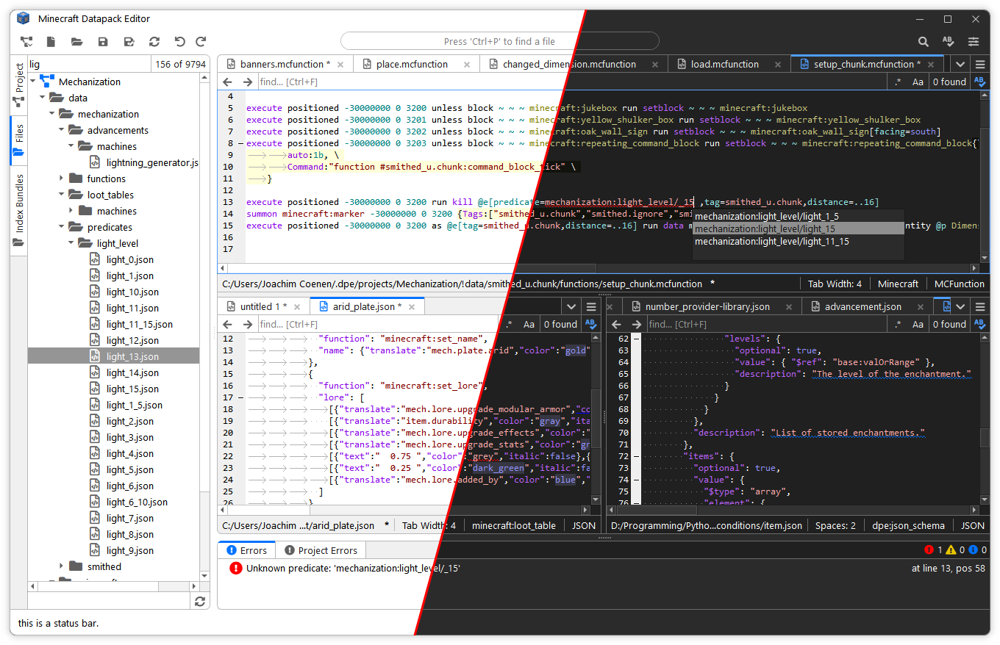
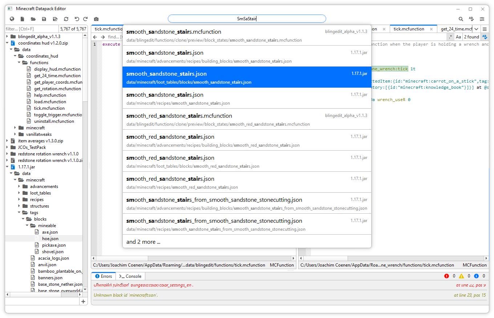

# Datapack-Editor

An editor for Minecraft datapacks for Minecraft 1.17 and 1.18.

![MainWindow1_IMG][MainWindow1_IMG]

This program can be used for creating and editing datapacks easily and conveniently.  
Its main focus is editing `.mcFunction` files.

## Features
- Open or create a new datapack
- Have multiple datapacks loaded (usefull when creating a plugin to an existing datapack)
- Syntax highlighting 
- Error checking and context sensitive code suggestions and code completion (`.mcFunction` files only)
- Ctrl-Click to follow symbols (for functions & function tags, block tags, ... )
- Multi-tab & multi-view eitor
- Quickly find and open files
- Search all files
- Validate all files (for `.mcFunction` files only)
- Add, rename and delete files and folders via the left-side tree view
- Program remembers last session after closing

## Keyboard Shortcuts

| Action | Shortcut |
| ------------- | ------------- |
| Find in all files | `Ctrl`+`Shift`+`F` |
| Quickly find a file | `Ctrl`+`P` |
| New (scratch) file | `Ctrl`+`N` |
| Save current file | `Ctrl`+`S` |
| Save as | `Ctrl`+`Shift`+`S` |

| Action | Shortcut |
| ------------- | ------------- |
| Duplicate line | `Ctrl`+`D` |
| Find in current document | `Ctrl`+`F` |
| Trigger code suggestions | `Ctrl`+`Space` |

## Download
The program supports data packs for Minecaft 1.17 and 1.18. It currently only runs on Windows.

Warning: This Software is work in progress. Use it at your own risk. (bug reports are welcome!)

[Current Version][DownloadLatest_LINK] <--  
[Other Versions][Releases_LINK]

Download the zip file, extract it to a folder and run the `start.cmd` file.

## Screenshots 
<table style="width:100%;border-spacing:0px">
  <!--
  <tr style="padding:0px">
    <td colspan="2" style="padding:0px">  </td>
  </tr>
  -->
  <tr style="padding:0px">
    <td style="padding:0px">  </td>
    <td style="padding:0px">  </td>
  </tr>
</table>

## Disclaimer
Some contents in the program are from the Minecraft Wiki (see [Minecraft Wiki:General disclaimer][MCWikiGeneralDisclaimer_LINK]).

This program is not affiliated with Mojang Studios.

[MainWindow1_IMG]:    screenshots/mainWindow.png    "Main Window"
[QuickFind_IMG]:      screenshots/quickFind.png     "Quick Find"

[MCWikiGeneralDisclaimer_LINK]:  https://github.com/JoachimCoenen/Datapack-Editor/releases "Minecraft Wiki:General disclaimer"

[Releases_LINK]:                 https://github.com/JoachimCoenen/Datapack-Editor/releases "Datapack-Editor/releases"
[DownloadLatest_LINK]:           https://github.com/JoachimCoenen/Datapack-Editor/releases/latest  "latest"
