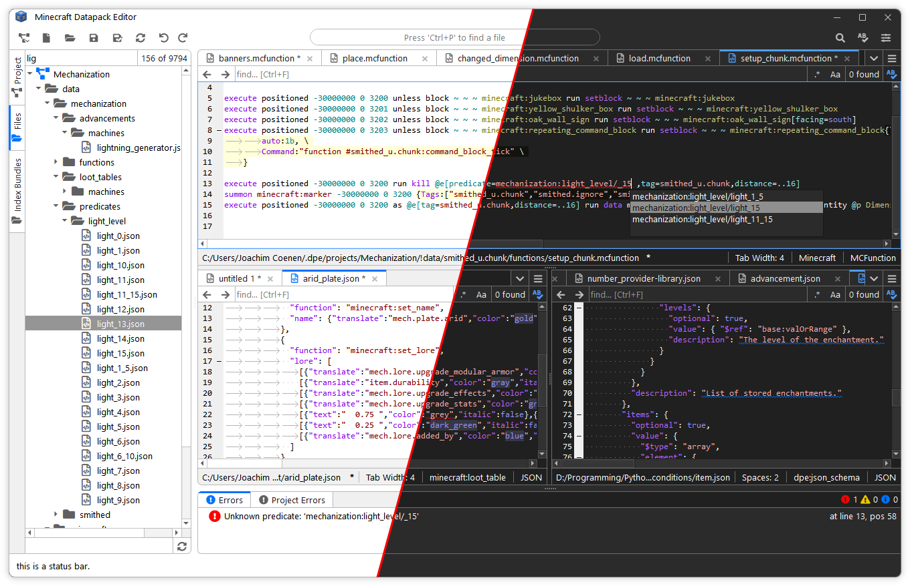
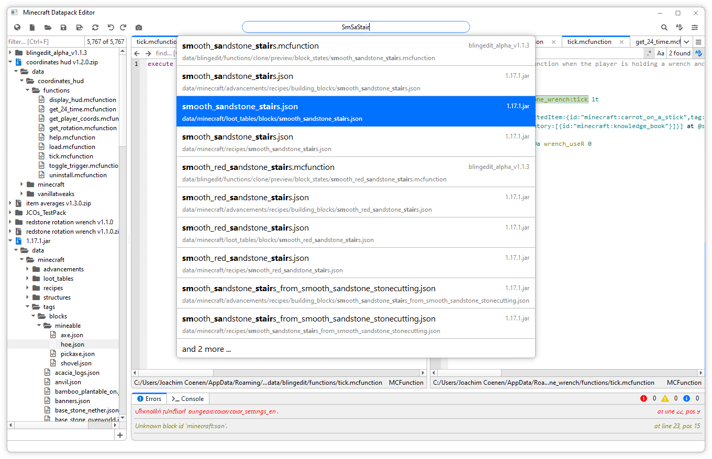
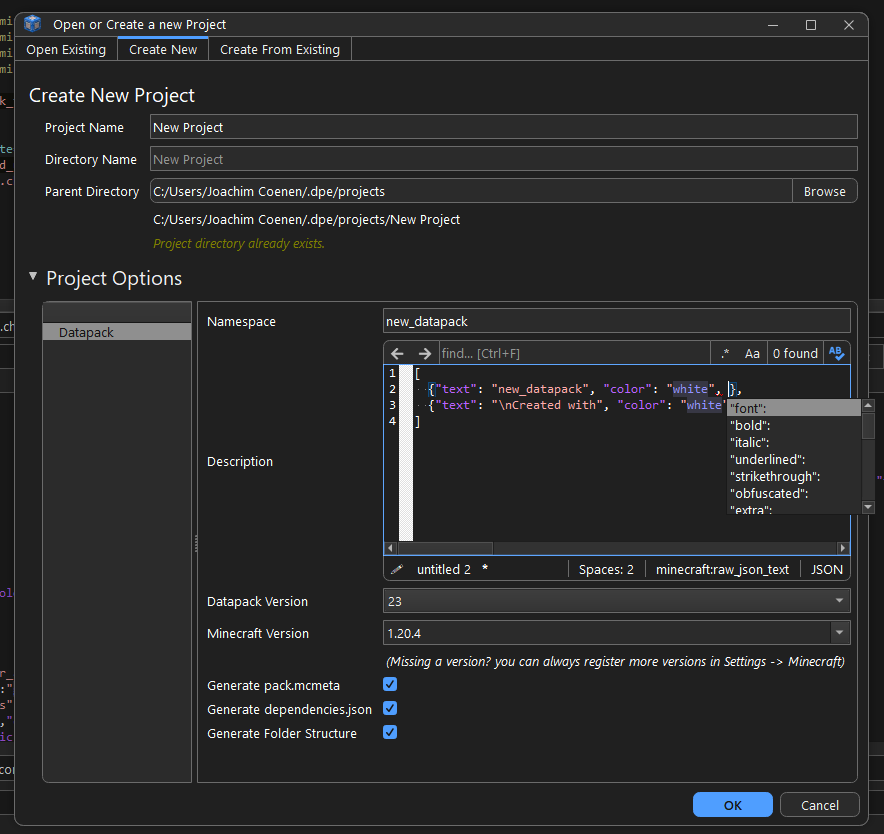
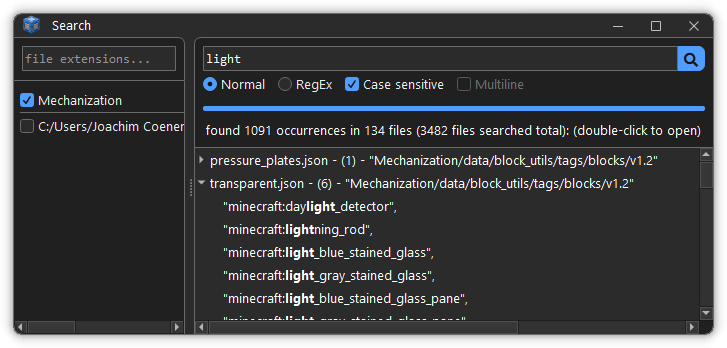
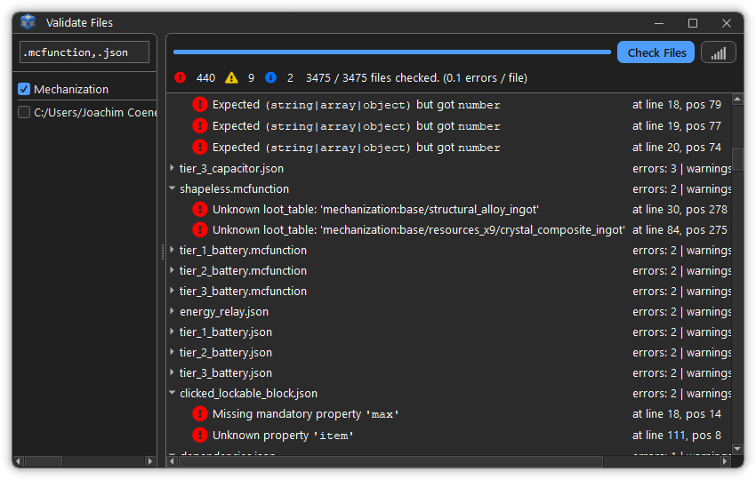
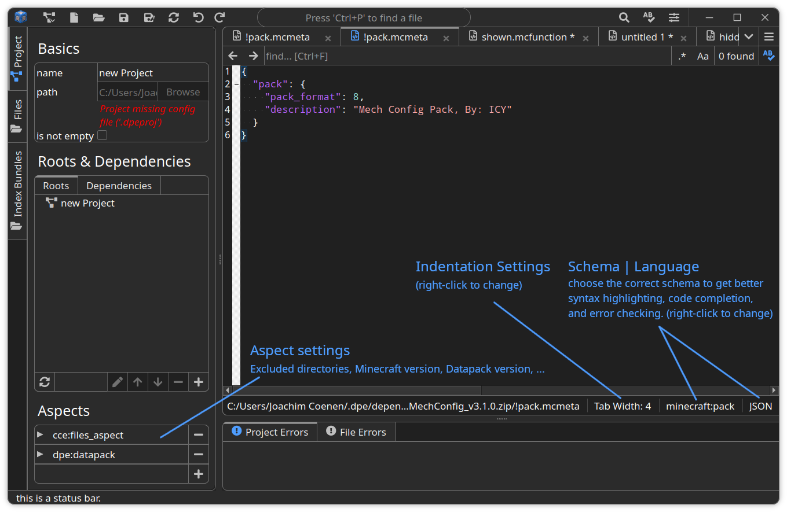

# Minecraft Datapack-Editor

 

  

An advanced creator & editor for Minecraft datapacks for Minecraft 1.20.2 - 1.20.6 (datapack version 18-41).
For Windows and Linux (Debian)

![MainWindow1_IMG][MainWindow1_IMG]

## Features
- Code Editing
  - Syntax highlighting 
  - Error checking with detailed error messages
  - Rich code suggestions and code completion for `.mcFunction` and `.json` files, including arbitrarily nested constructs 
    (e.g. a command inside SNBT inside another command inside JSON inside a mcFunction file). 
  - Add, rename and delete files and folders via the left-side tree view
- Project
  - Open or create a new datapack project
  - Validate all files (for `.mcFunction` and `.json` files) within a project
  - Multi-root projects
  - supports dependencies between datapacks / projects via `dependencies.json`
- Customization
  - custom themes
  - plugin support
- Navigation:
  - Ctrl-Click to follow symbols (functions & function tags, block tags, ... )
  - Multi-tab & multi-view editor
  - Quickly find and open files with `Ctrl`+`P`
  - Search in all files

## Keyboard Shortcuts

| Action                     | Shortcut           | Comment                                                                                   |
|----------------------------|--------------------|-------------------------------------------------------------------------------------------|
| Find in all files          | `Ctrl`+`Shift`+`F` |                                                                                           |
| Quickly find & open a file | `Ctrl`+`P`         |                                                                                           |
| New (scratch) file         | `Ctrl`+`N`         | You can also create a new file at its location in the "Files" view on the left-hand side. |
| Save current file          | `Ctrl`+`S`         |                                                                                           |
| Save as                    | `Ctrl`+`Shift`+`S` |                                                                                           |

| Action                   | Shortcut       |
|--------------------------|----------------|
| Duplicate line           | `Ctrl`+`D`     |
| Find in current document | `Ctrl`+`F`     |
| Trigger code suggestions | `Ctrl`+`Space` |
| Show call tips           | `Ctrl`+`K`     |

## Download & Install

[Current Version][DownloadLatest_LINK] <--  
[Other Versions][Releases_LINK]

* Windows
  * Download the zip file, extract it to an empty folder and run the `start.cmd` file.
  * Avast, AVG, and Zillya might label the windows executable as malware[[1]][virustotal_LINK].
    This is a **false positive** caused by the way this application has been packaged[[2]][pyinstaler_malware_LINK]. See issue [#51](https://github.com/JoachimCoenen/Datapack-Editor/issues/51).
* Linux
  * Download the zip file, extract it to an empty folder and run the `Datakack Editor` file.

If you have any questions, problems or suggestions, feel free to create an [Issue][NewIssue_LINK]. 

## Screenshots 
</img>
</img>

</img>
</img>
</img>
</img>

## Disclaimer
This program is not affiliated with Mojang Studios.  
Some contents in the program are from the Minecraft Wiki (see [Minecraft Wiki:General disclaimer][MCWikiGeneralDisclaimer_LINK]).

[MainWindow1_IMG]:          screenshots/mainWindow.png           "Main Window"
[QuickFind_IMG]:            screenshots/quickFind.png            "Quick Find"
[NewProject_IMG]:           screenshots/createNewProject.png     "Create New Project Dialog"
[Search_IMG]:               screenshots/search.png               "Search Dialog"
[ValidateFiles_IMG]:        screenshots/validateFiles.png        "Validate File"
[MainWindow_annotated_IMG]: screenshots/mianWindow_annotated.png "Main Window annotated"

[MCWikiGeneralDisclaimer_LINK]:  https://minecraft.wiki/w/Minecraft_Wiki:General_disclaimer "Minecraft Wiki:General disclaimer"

[Releases_LINK]:                 https://github.com/JoachimCoenen/Datapack-Editor/releases "Datapack-Editor/releases"
[DownloadLatest_LINK]:           https://github.com/JoachimCoenen/Datapack-Editor/releases/latest  "latest"
[NewIssue_LINK]:                 https://github.com/JoachimCoenen/Datapack-Editor/issues/new  "New issue"
[virustotal_LINK]:               https://www.virustotal.com/gui/file/c7ed215e40289939f47a5cb6563ee3369959481af54ab0a2bc3f2f03f4705e75  "Virus Total results"
[pyinstaler_malware_LINK]:       https://github.com/pyinstaller/pyinstaller/issues/5854  "pyinstaler issue #5854"

